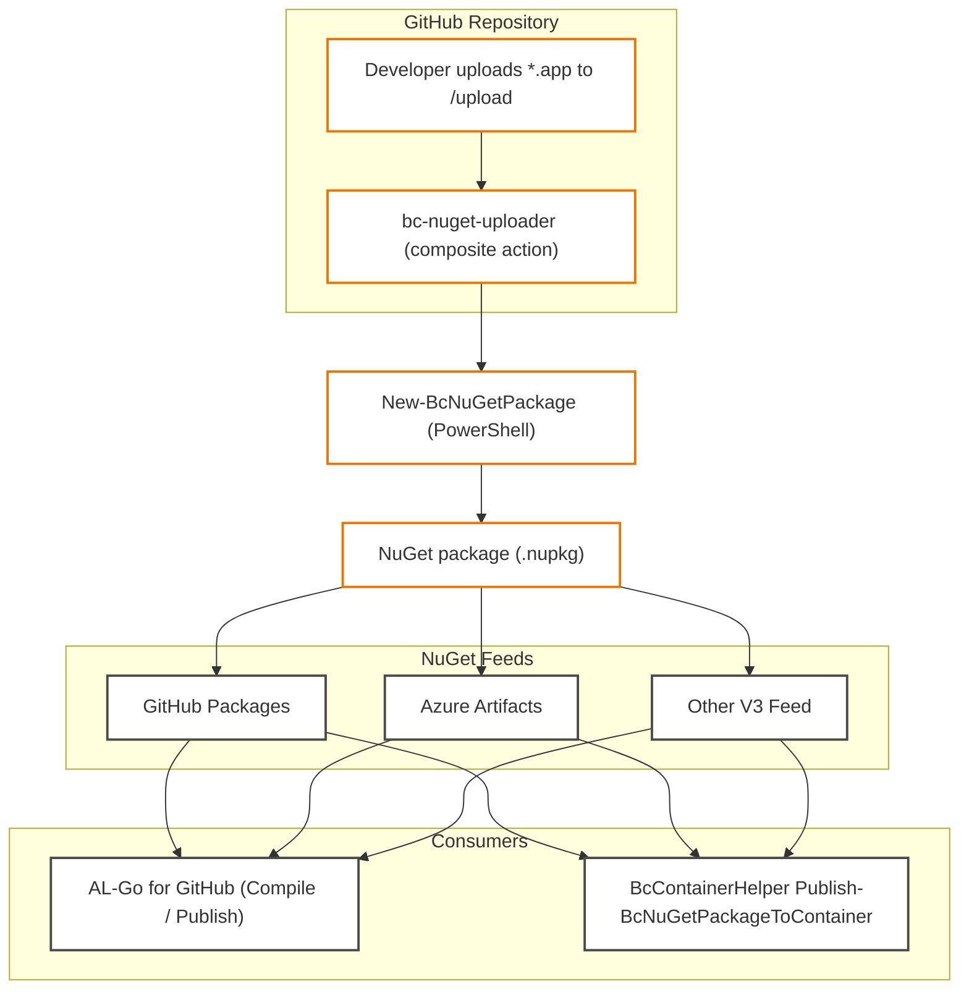

# bc-nuget-uploader – GitHub Action

GitHub Action for uploading Business Central `.app` files as NuGet packages.
A typical use case is the integration of 3rd party apps into own CI/CD or deployment pipelines, e.g. based on [AL-Go](https://github.com/microsoft/AL-Go/).

This action is designed to be reused across repositories and GitHub organizations. It wraps a PowerShell script that builds NuGet packages using the Business Central Container Helper and pushes them to GitHub Packages or external NuGet feeds.

## What It Does

- Detects `.app` files in the `/upload` folder
- Generates NuGet packages using `New-BcNuGetPackage`
- Checks if the package version already exists
- Pushes the package to the appropriate feed
- Supports multiple feeds using a GUID-to-feed mapping

## Usage / Setup Instructions

### 1. Reference the Composite Action

Create a workflow in `.github/workflows/upload-apps.yml`:

```yaml
name: Process Uploaded .app Files
on:
  push:
    branches: [main]
    paths:
      - 'upload/*.app'
  workflow_dispatch:

permissions:
  contents: read
  packages: write

jobs:
  upload-apps:
    runs-on: ubuntu-latest
    steps:
      - name: Checkout repository
        uses: actions/checkout@v4

      - name: Run Business Central NuGet uploader
        uses: AidentErfurt/bc-nuget-uploader@v1
        with:
          feed-map: nuget-feed-map.json
          fail-on-any-error: true
        env:
          GITHUB_TOKEN: ${{ secrets.GITHUB_TOKEN }}
          MY_NUGET_FEED_TOKEN: ${{ secrets.MY_NUGET_FEED_TOKEN }}  # Token used if GUID matches

```

In this example, `MY_NUGET_FEED_TOKEN` should be defined as a secret in your repository. A NuGet package for an app with ID `b1755fc0-be57-424a-8e0a-8533dc9122d7` (from your app.json) will be pushed to the feed at the configured URL using this token.

### 2. Add Feed Configuration (Optional)

To support multiple external feeds, create a file named `nuget-feed-map.json` in the repository root:

```json
{
  "b1755fc0-be57-424a-8e0a-8533dc9122d7": {
    "url": "https://your-private-feed/index.json",
    "token": "MY_NUGET_FEED_TOKEN"
  }
}
```

Multiple feeds for one app:

```json
{
    "b1755fc0-be57-424a-8e0a-8533dc9122d7": [
      {
        "url": "https://your-private-feed/index.json",
        "token": "MY_NUGET_FEED_TOKEN"
      },
      {
        "url": "https://nuget.pkg.github.com/AidentErfurt/index.json",
        "token": "GITHUB_TOKEN"
      }
    ]
}
```

Each entry maps a specific app's GUID (from its `app.json`) to:

- The GUID is the unique app ID from app.json
- A `url`: the NuGet server endpoint
- A `token`: the name of a GitHub Secret that holds the authentication token for the feed

If no matching GUID is found in this configuration, the package will be pushed to GitHub Packages in the current repository using the default `GITHUB_TOKEN`.

## Requirements

- GitHub Actions enabled
- `packages: write` and `contents: read` permissions
- PowerShell-compatible runners (Linux, macOS, or Windows)

## Upload Instructions (for Business Central Admins / End Users)

This section explains how to upload `.app` files. You do **not** need to write code or modify workflows.

### 1. Upload Your `.app` File

1. Go to the GitHub repository in your browser.
2. Navigate to the `upload/` folder.
3. Click **Add file > Upload files**.
4. Select the `.app` file(s) you want to upload from your local machine.
5. Click **Commit changes** at the bottom of the page.

### 2. Wait for the Upload to Complete

- After committing, a GitHub Action will run automatically.
- It will:
  - Convert your `.app` into a NuGet package.
  - Skip the upload if the package already exists in the feed.

You can monitor the progress under the **Actions** tab in GitHub.

No manual cleanup or publishing steps are required.

# Flow



# Licence

© 2025 Aident GmbH. Released under Apache 2.0
